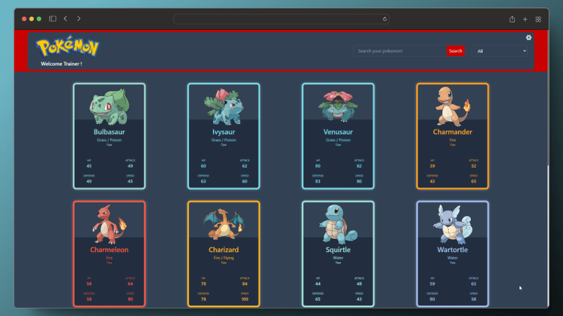

# PokeAPI Project

Este proyecto utiliza React para mostrar información de Pokémons utilizando la PokeAPI. Proporciona funcionalidades como el listado de Pokémons, detalles individuales, modo oscuro, y más.

## Características

- Listado de Pokémons con información detallada.
- Modo oscuro para mejorar la experiencia de usuario.
- Animaciones incorporadas utilizando Framer Motion.
- Uso de Redux Toolkit para el manejo del estado de la aplicación.
- Integración de Axios y Fetch para realizar solicitudes HTTP a la PokeAPI.
- Utilización de React DOM para el renderizado.
- Iconos de RemixIcon para mejorar la interfaz de usuario.

## Instalación

1. Clona el repositorio: `git clone https://github.com/tu-usuario/pokeapi-project.git`
2. Ingresa al directorio: `cd pokeapi-project`
3. Instala las dependencias: `npm install`
4. Inicia la aplicación: `npm start`

## Modo de Uso

Una vez que la aplicación esté en funcionamiento, podrás:
- Explorar la lista de Pokémons.
- Ver detalles individuales de cada Pokémon.
- Activar el modo oscuro para una mejor experiencia visual.

## Modo Oscuro

La aplicación incluye un modo oscuro para mejorar la usabilidad en entornos con poca luz. Para activarlo, dirígete a la configuración dentro de la aplicación y selecciona "Modo Oscuro".

## Colaboradores

Este proyecto ha sido posible gracias a la contribución de:

- [Jesús Aguilar](https://github.com/JesusAguilarAliaga)
- [Dergi Samayoa](https://github.com/DergiSamayoa)
- [Cristiano Sime](https://github.com/SimeneitorT1000)

¡Gracias a todos por su arduo trabajo!

## Librerías Utilizadas

- [Redux Toolkit](https://redux-toolkit.js.org/)
- [Axios](https://axios-http.com/)
- [Framer Motion](https://www.framer.com/motion/)
- [React DOM](https://reactjs.org/docs/react-dom.html)
- [RemixIcon](https://remixicon.com/)

## Contribuciones

¡Las contribuciones son bienvenidas! Si deseas mejorar este proyecto, siéntete libre de crear un Pull Request.

## Licencia

Este proyecto está bajo la licencia MIT. Consulta el archivo `LICENSE` para más detalles.